# 🔄 User Flows & Journeys

## 🎯 Ana Kullanıcı Akışları

### **1. Ziyaretçi → Kayıtlı Kullanıcı**

```mermaid
graph TD
    A[Landing Page] --> B{İlk Eylem}
    B -->|Tool Dene| C[Tool Sayfası]
    B -->|Fiyatlandırma| D[Pricing Page]
    B -->|Sign Up| E[Kayıt Formu]
    
    C --> F[Tool Kullan]
    F --> G{Limit Doldu mu?}
    G -->|Hayır| C
    G -->|Evet| H[Sign Up Prompt]
    
    D --> E
    H --> E
    
    E --> I[Email/Password]
    E --> J[Google OAuth]
    E --> K[GitHub OAuth]
    
    I --> L[Email Verification]
    J --> M[OAuth Callback]
    K --> M
    
    L --> N[Welcome Screen]
    M --> N
    
    N --> O[Dashboard]
```



---

### **2. Guest User Journey (Kayıtsız Kullanım)**

#### **Adım 1: Landing Page**
```typescript
// User arrives at homepage
{
  page: "/",
  cta_options: [
    "Try Free Tools", // Direkt tool'lara
    "See Pricing",
    "Sign Up"
  ],
  hero_message: "Professional Design Tools, Browser-Based & Private"
}
```

#### **Adım 2: Tool Selection**
```typescript
// User clicks on a tool
{
  page: "/color-picker", // or any tool
  access: "immediate", // No signup required for client-side
  limitations: {
    watermark: false, // Client-side tools don't have watermark
    history: false, // Not saved
    download: true // Can download
  }
}
```

#### **Adım 3: API Tool Attempt (Guest)**
```typescript
// User tries background remover (API tool)
{
  action: "upload_file",
  response: {
    type: "signup_wall",
    modal: {
      title: "Sign up to use API tools",
      description: "Get 10 free operations daily",
      cta: "Sign Up Free",
      features: [
        "10 daily API operations",
        "All client-side tools",
        "7-day history"
      ]
    }
  }
}
```

---

### **3. Sign Up Flow (Detaylı)**

#### **Yöntem 1: Email/Password**

```typescript
// Step 1: Sign Up Form
{
  page: "/signup",
  fields: [
    { name: "email", required: true, validation: "email" },
    { name: "password", required: true, minLength: 8 },
    { name: "full_name", required: false }
  ],
  
  // Step 2: Email Verification
  after_submit: {
    action: "send_verification_email",
    redirect: "/verify-email",
    message: "Check your inbox for verification link"
  },
  
  // Step 3: Email Click
  verification_link: {
    url: "/auth/confirm?token=xxx",
    expires: "24h",
    action: {
      success: {
        redirect: "/welcome",
        create_profile: true,
        set_plan: "free"
      },
      error: {
        message: "Link expired or invalid",
        action: "resend_email"
      }
    }
  }
}
```

#### **Yöntem 2: Google OAuth**

```typescript
// Step 1: Click "Sign up with Google"
{
  action: "oauth_google",
  scopes: ["email", "profile"],
  
  // Step 2: Google Auth Screen
  google_consent: {
    permissions: [
      "See your email address",
      "See your basic profile"
    ]
  },
  
  // Step 3: OAuth Callback
  callback: {
    url: "/auth/callback",
    process: {
      get_user_info: true,
      check_existing_account: true,
      create_or_login: "automatic"
    },
    redirect: {
      new_user: "/welcome",
      existing_user: "/dashboard"
    }
  }
}
```

#### **Welcome Screen**

```typescript
// First-time user onboarding
{
  page: "/welcome",
  content: {
    title: "Welcome to Design Kit! 🎉",
    steps: [
      {
        title: "Your Free Plan",
        description: "10 daily API operations, all client-side tools",
        cta: "Got it"
      },
      {
        title: "Try Your First Tool",
        tool_suggestions: [
          "Color Picker - Extract colors from images",
          "QR Generator - Create custom QR codes"
        ],
        cta: "Let's Go"
      }
    ]
  },
  skip_option: true,
  redirect_after: "/dashboard"
}
```

---

### **4. Login Flow**

#### **Standard Login**

```typescript
// Step 1: Login Form
{
  page: "/login",
  fields: [
    { name: "email", type: "email" },
    { name: "password", type: "password" }
  ],
  options: [
    { label: "Remember me", type: "checkbox" },
    { label: "Forgot password?", link: "/reset-password" }
  ],
  
  // Step 2: Authentication
  submit: {
    success: {
      redirect: "/dashboard",
      session: {
        duration: "7_days", // if remember_me
        type: "jwt"
      }
    },
    error: {
      invalid_credentials: {
        message: "Invalid email or password",
        attempts_left: 3, // After 5 failed attempts
        lockout: "15_minutes"
      }
    }
  }
}
```

#### **Password Reset**

```typescript
// Step 1: Request Reset
{
  page: "/reset-password",
  action: "enter_email",
  submit: {
    send_email: {
      template: "password_reset",
      link_expires: "1h"
    },
    response: "Check your email for reset link"
  },
  
  // Step 2: Reset Link Click
  reset_page: {
    url: "/reset-password/confirm?token=xxx",
    form: [
      { name: "new_password", minLength: 8 },
      { name: "confirm_password", mustMatch: true }
    ]
  },
  
  // Step 3: Password Changed
  success: {
    message: "Password updated successfully",
    redirect: "/login",
    auto_logout: true // Logout all sessions
  }
}
```

---

### **5. Tool Usage Flow (Client-Side)**

#### **Color Picker Example**

```typescript
// Step 1: Navigate to Tool
{
  page: "/color-picker",
  components: {
    header: "Tool navigation",
    info: "Tool description",
    upload_area: "Drag & drop or browse"
  }
}

// Step 2: Upload Image
{
  action: "upload_file",
  validation: {
    max_size: "10MB", // Free user
    allowed_types: ["image/png", "image/jpeg", "image/webp"]
  },
  processing: {
    location: "client_browser",
    steps: [
      "Read file",
      "Draw to canvas",
      "Enable color picking"
    ]
  }
}

// Step 3: Pick Colors
{
  interaction: "click_on_canvas",
  result: {
    show_color_info: {
      hex: "#3B82F6",
      rgb: "59, 130, 246",
      hsl: "217, 91%, 60%"
    },
    add_to_history: true
  }
}

// Step 4: Copy/Export
{
  actions: [
    { label: "Copy HEX", clipboard: "#3B82F6" },
    { label: "Copy RGB", clipboard: "rgb(59, 130, 246)" },
    { label: "Export Palette", download: "palette.json" }
  ]
}
```

---

### **6. Tool Usage Flow (API-Based)**

#### **Background Remover Example**

```typescript
// Step 1: Navigate to Tool
{
  page: "/background-remover",
  auth_check: true, // Must be logged in
  quota_check: {
    current: 5,
    limit: 10, // Free user
    remaining: 5
  }
}

// Step 2: Upload Image
{
  action: "upload_file",
  validation: {
    max_size: "10MB",
    allowed_types: ["image/png", "image/jpeg"]
  },
  
  // Step 3: Quota Check
  quota_validation: {
    check: "can_use_api_tool(user_id)",
    if_exceeded: {
      modal: {
        title: "Daily limit reached (10/10)",
        message: "Upgrade to Premium for 500 daily operations",
        cta_primary: "Upgrade Now",
        cta_secondary: "Wait until tomorrow"
      }
    }
  }
}

// Step 4: Processing (if quota OK)
{
  steps: [
    {
      status: "uploading",
      message: "Uploading your image...",
      progress: "30%"
    },
    {
      status: "processing",
      message: "Removing background...",
      progress: "70%",
      api_call: {
        service: "remove.bg",
        estimated_time: "5-10 seconds"
      }
    },
    {
      status: "complete",
      message: "Background removed!",
      progress: "100%"
    }
  ]
}

// Step 5: Download
{
  result: {
    preview: "show_before_after",
    download_button: {
      label: "Download PNG",
      action: "save_to_device"
    }
  },
  
  // Step 6: Update Usage
  post_process: {
    increment_quota: true,
    log_usage: {
      tool: "background-remover",
      success: true,
      file_size: "2.4MB",
      processing_time: "8s"
    }
  }
}
```

---

### **7. Upgrade Flow (Free → Premium)**

#### **Trigger Points**

```typescript
const upgradeTriggers = [
  {
    location: "limit_reached_modal",
    context: "User hit daily limit (10/10)",
    cta: "Upgrade to Premium"
  },
  {
    location: "dashboard_banner",
    message: "Unlock 500 daily operations",
    cta: "See Plans"
  },
  {
    location: "tool_page_tooltip",
    message: "Premium users get 50MB file size",
    cta: "Upgrade"
  }
]
```

#### **Checkout Flow**

```typescript
// Step 1: Pricing Page
{
  page: "/pricing",
  selected_plan: "premium", // User clicked from trigger
  options: {
    billing_cycle: ["monthly", "yearly"],
    default: "monthly"
  }
}

// Step 2: Checkout Button
{
  action: "click_upgrade_button",
  auth_check: {
    logged_in: "proceed_to_stripe",
    guest: "show_signup_modal"
  }
}

// Step 3: Stripe Checkout
{
  stripe_session: {
    mode: "subscription",
    success_url: "/dashboard?upgraded=true",
    cancel_url: "/pricing",
    customer_info: {
      email: "prefilled_from_account",
      name: "prefilled_from_profile"
    },
    payment_methods: [
      "card",
      "google_pay",
      "apple_pay"
    ]
  }
}

// Step 4: Payment Success
{
  webhook: {
    event: "checkout.session.completed",
    actions: [
      "update_user_plan_to_premium",
      "create_subscription_record",
      "send_confirmation_email",
      "log_conversion"
    ]
  },
  
  redirect: {
    page: "/dashboard",
    toast: {
      type: "success",
      message: "🎉 Welcome to Premium!",
      description: "You now have 500 daily operations"
    }
  }
}
```

---

### **8. Dashboard Usage Flow**

#### **Dashboard Landing**

```typescript
{
  page: "/dashboard",
  sections: [
    {
      name: "Quick Stats",
      cards: [
        {
          label: "Today's Usage",
          value: "127 / 500",
          progress_bar: true,
          color: "blue"
        },
        {
          label: "Current Plan",
          value: "Premium",
          badge: true,
          action: "Manage Subscription"
        },
        {
          label: "This Month",
          value: "3,421 operations",
          chart: "line"
        }
      ]
    },
    {
      name: "Recent Activity",
      table: {
        columns: ["Tool", "File", "Date", "Status"],
        rows: [
          ["Background Remover", "photo.jpg", "2 min ago", "✓"],
          ["Image Upscaler", "logo.png", "1 hour ago", "✓"]
        ],
        pagination: true
      }
    },
    {
      name: "Quick Actions",
      buttons: [
        { label: "New Tool", icon: "Plus" },
        { label: "View History", icon: "Clock" },
        { label: "Settings", icon: "Settings" }
      ]
    }
  ]
}
```

---

### **9. Settings & Account Management**

#### **Settings Tabs**

```typescript
{
  page: "/settings",
  tabs: [
    {
      name: "Profile",
      fields: [
        { label: "Full Name", type: "text" },
        { label: "Email", type: "email", disabled: true },
        { label: "Avatar", type: "image_upload" }
      ]
    },
    {
      name: "Subscription",
      content: {
        current_plan: {
          name: "Premium",
          price: "$9/month",
          next_billing: "Feb 15, 2025",
          actions: [
            { label: "Upgrade to Pro", variant: "primary" },
            { label: "Cancel Subscription", variant: "destructive" }
          ]
        },
        usage_stats: {
          show: true,
          reset_countdown: "Resets in 8h 23m"
        }
      }
    },
    {
      name: "Billing",
      content: {
        payment_method: {
          type: "Visa ****1234",
          expires: "12/26",
          action: "Update Card"
        },
        invoice_history: {
          table: true,
          download_option: true
        }
      }
    },
    {
      name: "Security",
      fields: [
        { label: "Change Password", type: "button" },
        { label: "Two-Factor Auth", type: "toggle", value: false },
        { label: "Active Sessions", type: "list" }
      ]
    },
    {
      name: "Preferences",
      fields: [
        { label: "Theme", type: "select", options: ["Light", "Dark", "Auto"] },
        { label: "Email Notifications", type: "toggle" },
        { label: "Usage Alerts", type: "toggle" }
      ]
    }
  ]
}
```

---

### **10. Subscription Cancellation Flow**

```typescript
// Step 1: Cancel Button Click
{
  page: "/settings/subscription",
  action: "click_cancel",
  
  // Step 2: Confirmation Modal
  modal: {
    type: "warning",
    title: "Cancel Premium?",
    description: "You'll keep Premium access until Feb 15, 2025",
    consequences: [
      "❌ Limit will drop to 10 daily operations",
      "❌ Max file size will be 10MB",
      "✅ You'll keep your data and history"
    ],
    retention_offer: {
      show: true,
      message: "Stay for 20% off for 3 months?",
      discount_code: "STAYWITHUS20"
    },
    buttons: [
      { label: "Keep Premium", variant: "primary" },
      { label: "Continue Cancellation", variant: "ghost" }
    ]
  }
}

// Step 3: Feedback (Optional)
{
  feedback_form: {
    question: "Help us improve - why are you leaving?",
    options: [
      "Too expensive",
      "Not using enough",
      "Missing features",
      "Switching to competitor",
      "Other"
    ],
    optional_text: true,
    skip_option: true
  }
}

// Step 4: Confirmation
{
  final_confirmation: {
    message: "Subscription canceled",
    details: [
      "Premium access until: Feb 15, 2025",
      "After that, you'll be on the Free plan",
      "You can reactivate anytime before then"
    ],
    email_sent: true
  },
  
  // Backend Action
  update: {
    subscription: {
      cancel_at_period_end: true,
      status: "active" // Still active until period end
    }
  }
}
```

---

### **11. Error & Edge Case Flows**

#### **Payment Failed**

```typescript
{
  trigger: "stripe_webhook: invoice.payment_failed",
  
  // Step 1: First Failure
  actions: {
    retry_payment: {
      schedule: "24h_later",
      attempts: 3
    },
    notify_user: {
      email: {
        subject: "Payment Failed - Please Update Card",
        cta: "Update Payment Method",
        link: "/settings/billing"
      },
      dashboard_banner: {
        type: "warning",
        message: "Payment failed - Please update your card",
        dismissible: false
      }
    }
  },
  
  // Step 2: After 3 Failures
  if_all_failed: {
    subscription_status: "past_due",
    access: {
      api_tools: "disabled",
      client_tools: "enabled",
      message: "Update payment to restore API access"
    },
    grace_period: "7_days"
  },
  
  // Step 3: After Grace Period
  if_not_resolved: {
    subscription_status: "canceled",
    plan: "free",
    notification: "Your subscription has been canceled due to payment failure"
  }
}
```

#### **File Upload Errors**

```typescript
const uploadErrors = {
  too_large: {
    condition: "file_size > max_allowed",
    message: "File too large (max 10MB for Free plan)",
    suggestion: "Upgrade to Premium for 50MB limit",
    cta: "Upgrade Now"
  },
  
  wrong_format: {
    condition: "file_type not in allowed_types",
    message: "Unsupported file format",
    allowed: "PNG, JPG, WEBP only"
  },
  
  corrupted: {
    condition: "cannot_read_file",
    message: "File appears to be corrupted",
    suggestion: "Try a different file"
  },
  
  quota_exceeded: {
    condition: "daily_limit_reached",
    message: "Daily limit reached (10/10)",
    reset_time: "8h 23m",
    cta: "Upgrade to Premium"
  }
}
```

---

### **12. Mobile Experience Flows**

#### **Mobile Navigation**

```typescript
{
  responsive_breakpoints: {
    mobile: "< 768px",
    tablet: "768px - 1024px",
    desktop: "> 1024px"
  },
  
  mobile_nav: {
    type: "hamburger_menu",
    items: [
      { label: "Tools", expandable: true },
      { label: "Dashboard" },
      { label: "Pricing" },
      { label: "Account", icon: "User" }
    ]
  },
  
  mobile_tool_usage: {
    file_upload: {
      method: "native_file_picker",
      supports_camera: true // Direct camera access
    },
    canvas_interaction: {
      touch_optimized: true,
      pinch_zoom: true
    }
  }
}
```

---

## ✅ Flow Testing Checklist

### Authentication Flows
- [ ] Sign up with email
- [ ] Sign up with Google
- [ ] Email verification
- [ ] Login with email
- [ ] Login with OAuth
- [ ] Password reset
- [ ] Logout

### Tool Usage Flows
- [ ] Client-side tool (guest)
- [ ] Client-side tool (logged in)
- [ ] API tool (within quota)
- [ ] API tool (quota exceeded)
- [ ] Batch processing
- [ ] Download results

### Upgrade/Downgrade
- [ ] Free → Premium upgrade
- [ ] Premium → Pro upgrade
- [ ] Downgrade request
- [ ] Cancellation flow
- [ ] Reactivation

### Error Handling
- [ ] File too large
- [ ] Invalid file format
- [ ] Payment failure
- [ ] Network error
- [ ] API service down

### Mobile
- [ ] Mobile navigation
- [ ] Mobile tool usage
- [ ] Mobile checkout
- [ ] Responsive layouts

---

**Son Güncelleme:** 2025-01-17  
**Durum:** ✅ Ready for UX Design & Development
